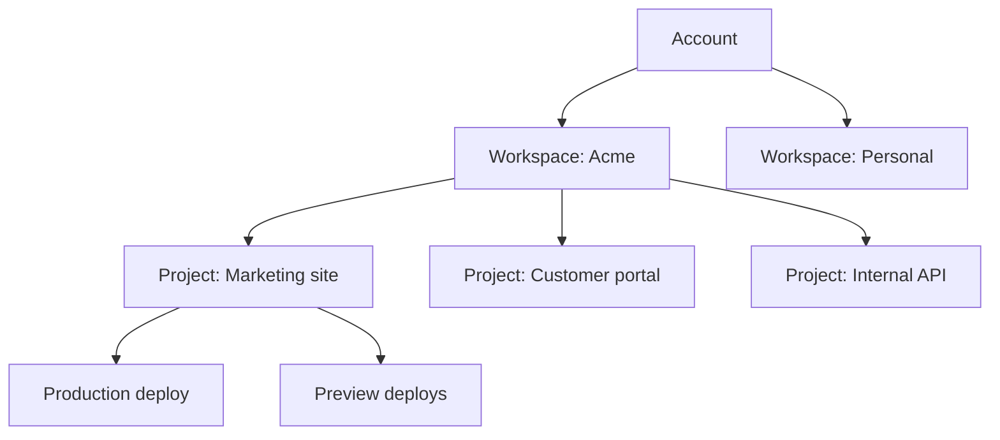

# Workspaces and projects

Workspaces and projects are the two containers that organise everything on the platform. Understanding the relationship between them makes the rest of the product much easier to navigate.

## The hierarchy

A workspace contains projects. Projects contain deploys, environment variables, and members.

## Workspaces

A workspace is the top-level container for a team's work. It owns:

* The list of members and their roles
* The billing relationship and plan
* Workspace-level settings like SSO and audit logs
* All projects created within it



Free, single-member workspaces. Good for evaluating the platform, side projects, or solo work. Limited to 3 active projects.



Multi-member workspaces with shared billing and a common plan. Most teams should use this. Includes audit logs and member roles.



Team workspaces with extras — SSO, SCIM provisioning, custom data residency, and a dedicated support contact.




You can belong to multiple workspaces at once. Switch between them using the workspace picker in the top-left of the dashboard.


## Projects

A project is a deployable unit. Each project has:

| Component       | What it does                                     |
| --------------- | ------------------------------------------------ |
| **Source**      | The repository or upload that produces the build |
| **Builds**      | The history of build attempts and their outputs  |
| **Deploys**     | Live versions of the project at a URL            |
| **Environment** | Variables and secrets specific to this project   |
| **Domains**     | The custom domains pointing at this project      |

Projects are isolated from each other. Environment variables, secrets, and configurations don't leak across projects in the same workspace.

## When to split into multiple projects

A common question: "should this be one project or two?"

Use **separate projects** when:

* The codebases are different
* They deploy independently
* They have different sets of secrets
* They need different access controls

Use **one project with multiple environments** when:

* It's the same codebase deploying to different URLs
* You want preview deploys per branch
* The differences are configuration, not code

## Related


[permissions.md](permissions.md)



[configuration.md](../reference/configuration.md)

